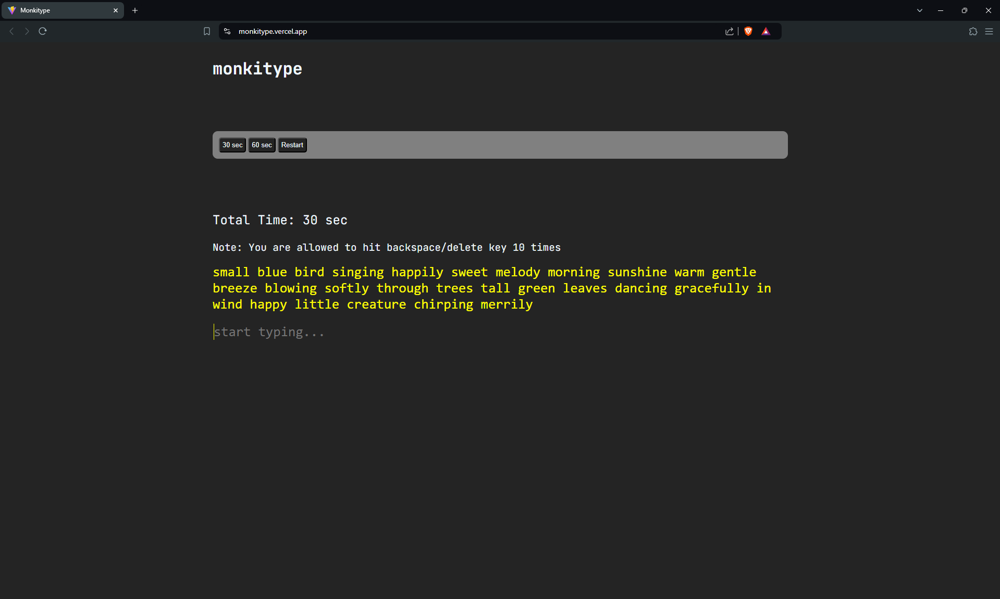
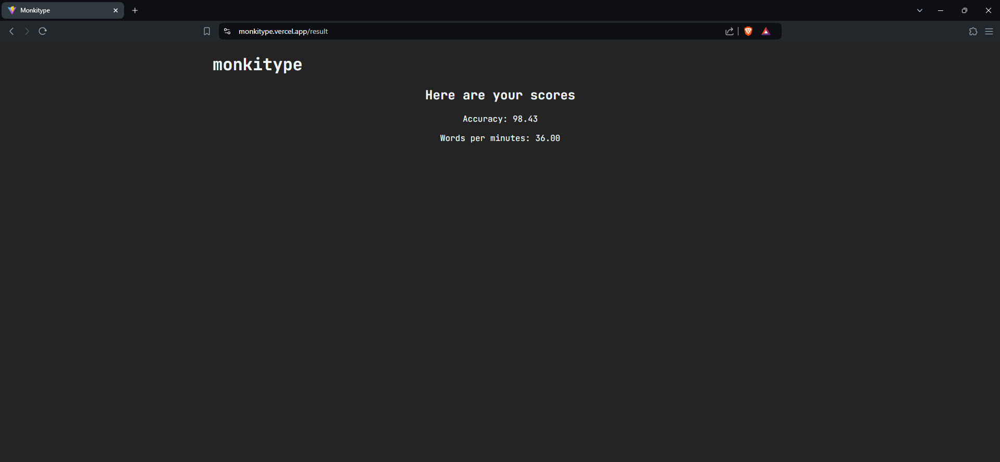

# Monkitype

Monkitype is a clone of the popular Monkeytype typing test app, designed to test and improve your typing speed and accuracy. Built with ReactJS and TypeScript, Monkitype offers a seamless user experience with added features to enhance the challenge. The app is deployed on Vercel for easy access.

## Key Features
- **Two Typing Modes**: Choose between a 30-second or 60-second typing test.
- **Accuracy & WPM Display**: After each test, view your typing accuracy and words per minute (WPM) on the score screen.
- **Backspace/Delete Limit**: Users can only use the backspace or delete keys up to 10 times per run, after which these keys are disabled to encourage accurate typing.

## Short Description
Monkitype challenges users to type a random paragraph within a set time limit, testing both speed and accuracy. The app displays performance metrics after each test, allowing users to track their progress. A unique feature limits the use of the backspace and delete keys to make the test more challenging, encouraging users to type with greater precision.

## Snippets
<h3>Monkitype Test</h3>

<h3>Scores</h3>

## Tech Used
- **Frontend**: ReactJS with TypeScript
- **Deployment**: Vercel

Monkitype combines a clean interface with practical features to offer a fun and effective typing practice tool.

## How to Use

1. Clone the repository: `git clone https://github.com/sarthakmishraa/monki-type.git`

Feel free to clone the repository and explore the project. Contributions are welcome!

## Contributing
Contributions are welcome! Please fork the repository and submit a pull request.